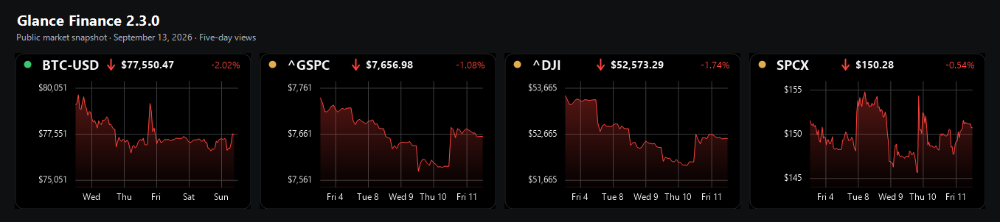
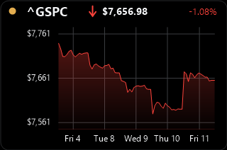
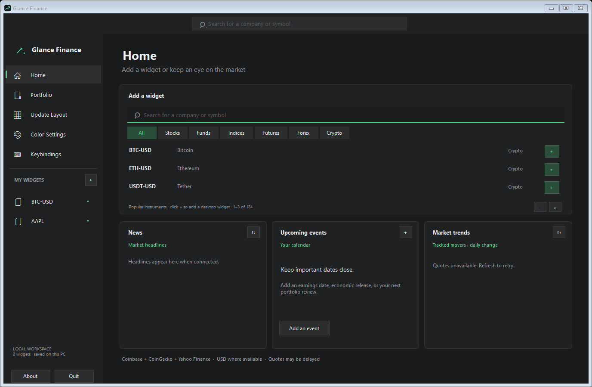
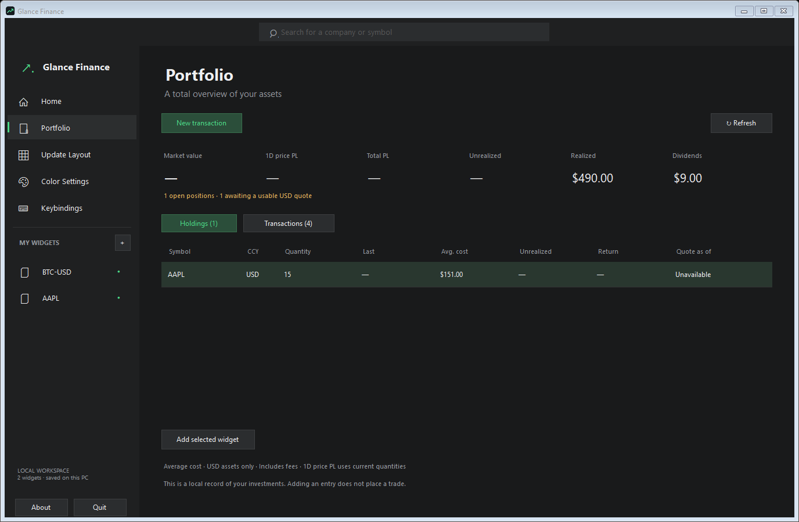
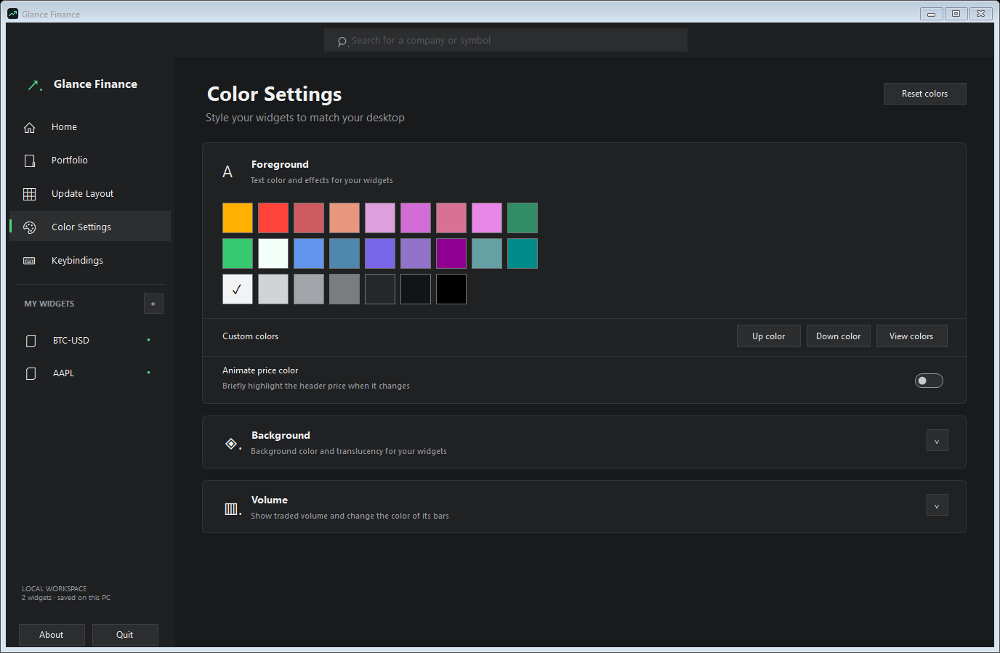

# Glance Finance

Public Windows downloads, release history and support for Glance Finance.
Application source and development history are maintained in the private
`Glance-Finance-Code` repository.

**[Download the latest Windows release](https://github.com/Brusko25/Glance-Finance-Releases/releases/latest)**

A compact desktop finance app with floating market widgets and a dark control
panel. Track stocks, funds, indices, futures, forex and crypto; organize widgets;
and keep a local record of your USD investments.

## Screenshots

Glance Finance 2.3.0, captured from the release build in an isolated example workspace. Click an image to see it full size.

**Five-day market widgets.** Public market snapshot captured September 13, 2026. Stocks and indices show their latest five trading sessions; Bitcoin includes calendar weekends. Prices may reflect the most recent closed session. This is a static screenshot.

| Stock chart detail | Find assets and add widgets |
| --- | --- |
|  |  |
| S&P 500 from the same public market snapshot. | Home with offline example data; live cards are inactive. |

| Track your portfolio | Customize your widgets |
| --- | --- |
|  |  |
| Illustrative transactions; live portfolio quotes are disabled. | Appearance controls in the isolated example workspace. |

[Image provenance and capture details](images/v2.3.0/README.md)

## Get started

1. Download **Glance-Finance-v2.3.0-Setup.exe** from the release page.
2. Run setup on Windows 10/11 with .NET Framework 4.8. It installs for your user without administrator rights.
3. Open **Glance Finance** from the Start menu. A desktop shortcut is optional.
4. Use **Home** to add widgets. Right-click a tile for its time range, coin, lock, and other options.

Prefer a portable copy? Download **Glance-Finance-v2.3.0-Windows.zip**, extract it into a writable folder, and run GlanceFinance.exe.

The app and installer are unsigned. **SHA256SUMS.txt** lists hashes for both downloads. GitHub's automatic Source code archives contain documentation, not the app.

## New in 2.3.0

- Stock, fund, and index charts compress closed-market time for a continuous view of available price samples. Five-day views show the latest five trading sessions with their actual dates.
- Yahoo chart samples use **1D → 5 minutes**, **five-day → 30 minutes**, and **1M → 180 minutes**, including pre-market and after-hours data when the provider supplies it.
- Three evenly spaced price references sit around the average visible price, with tighter reference spacing and room for the full price movement.
- Widget backgrounds are solid colors, with true black as the default. The widget layout stays the same.
- Crypto keeps its continuous calendar timeline, including weekends.

## Included features

Clean tiles with a bold price and arrow, percentage based on the visible graph, right-click time ranges, saved locking and corner resizing, corrected toggle graphics, a custom app icon, a top-100 crypto catalog, and a Windows installer.

## What's included

| Page | Controls |
| --- | --- |
| Home | Asset search, category filters, news, tracked movers and manual calendar dates |
| Portfolio | Local buys/sells/dividends, holdings, average cost and P&L |
| Update Layout | Resize, grid, alignment, mini mode, locking and mouse click-through |
| Color Settings | Foreground/background palettes, opacity, price flashes and volume bars |
| Keybindings | Custom shortcuts for focused widgets |
| My Widgets | Show/hide, bring forward, remove, pin and select chart range |

Closing the panel keeps widgets running. Reopen it from the system tray or a
widget's menu. Use **Quit** to close the entire app.

See the **[User guide](USER_GUIDE.md)** for complete controls and data behavior.

The crypto catalog is the top 100 coins by USD market cap from CoinGecko, captured September 8, 2026. Rankings are a release snapshot; quotes and history refresh from the providers. CoinGecko data is cached and rate-limited.

## Your data and updates

Your workspace, portfolio and settings stay in `workspace.json` beside the app.
No trades are submitted. Quotes come from Coinbase Exchange, CoinGecko and Yahoo Finance;
they can be delayed, unavailable or reflect a closed market. Yahoo's public
endpoints are unofficial. Portfolio totals support USD assets; calendar dates
are entered manually.

Updates are manual: use Quit, back up `workspace.json`, and rerun the installer over the same folder, or replace your portable executable and documentation. Uninstalling preserves workspace files. Download ZIPs contain
no settings or workspace files. `version.json` is public release metadata;
this version does not have an automatic updater.

## Support and history

- [Report a bug or request a feature](https://github.com/Brusko25/Glance-Finance-Releases/issues)
- [Release history](RELEASES.md)
- [Changelog](CHANGELOG.md)

Include your app and Windows versions, steps to reproduce, and exception text
when reporting a bug. Remove personal paths and holdings from screenshots/logs.
Do not upload your workspace, settings, backups or credentials.
