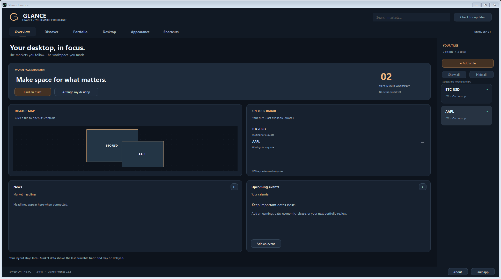
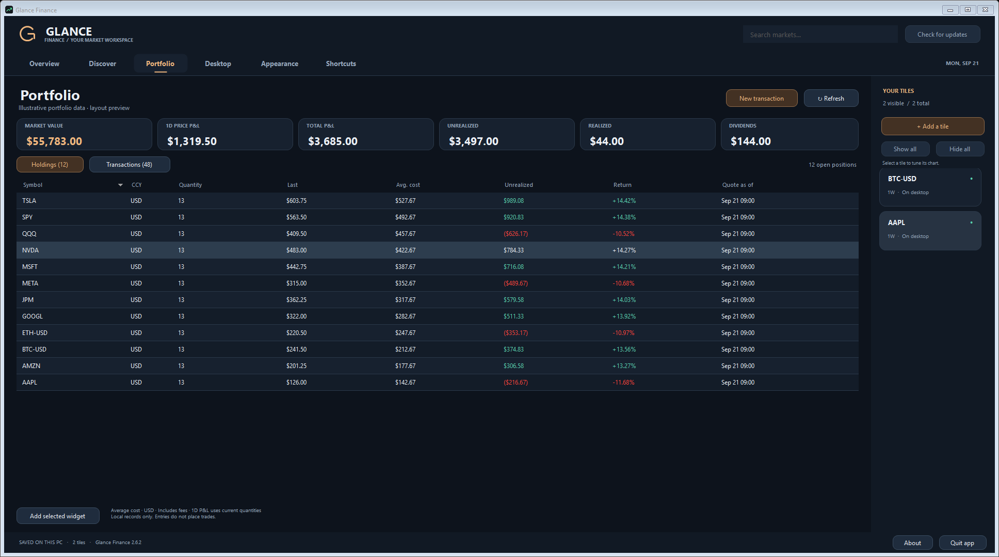
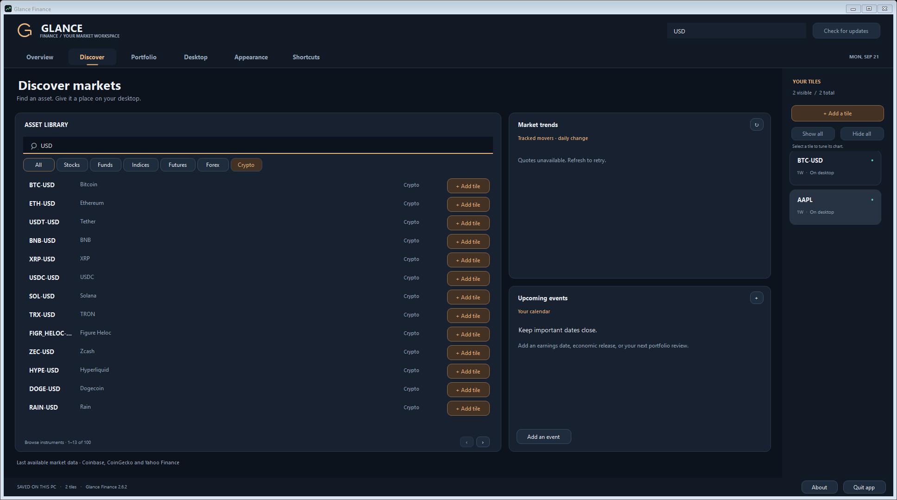
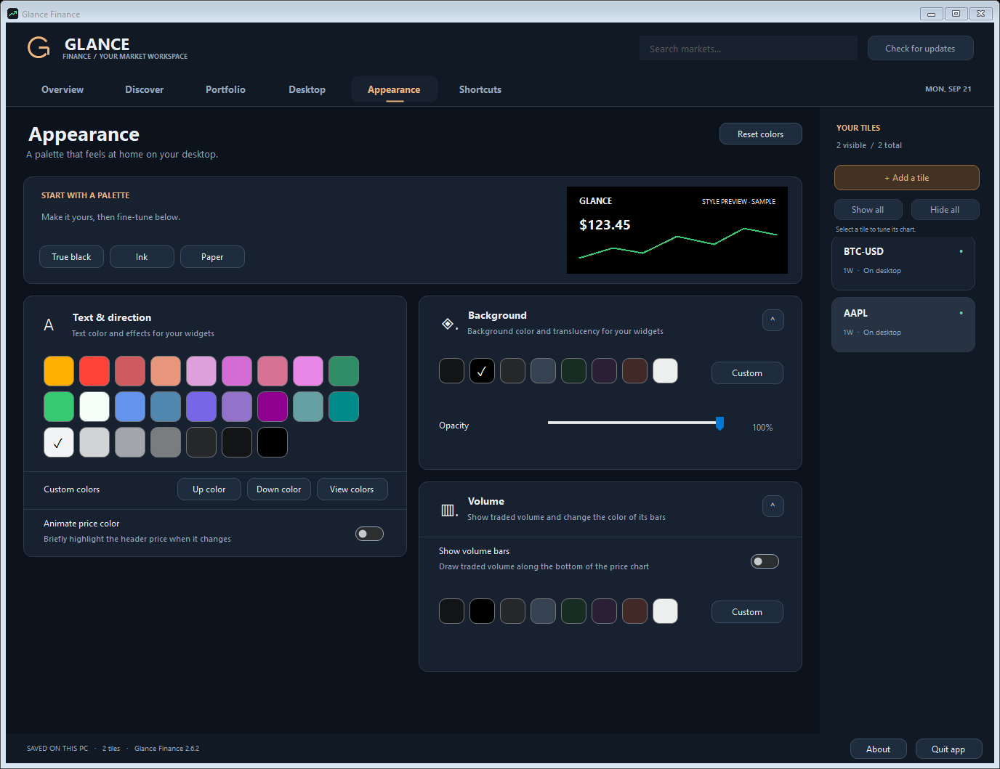

# Glance Finance

Public Windows downloads, release history and support for Glance Finance.
Application source and development history are maintained in the private
`Glance-Finance-Code` repository.

**[Download the latest Windows release](https://github.com/Brusko25/Glance-Finance-Releases/releases/latest)**

A desktop finance app with floating market tiles and a copper-and-ink workspace. Track stocks, funds, indices, futures, forex and crypto; organize widgets;
and keep a local record of your USD investments.

## Screenshots

Glance Finance 2.6.2, captured from the release build using isolated example data. Click any image to see it full size.

**A workspace that fits your window.** The Overview dashboard expands with the window. This offline fixture has live quotes and news disabled.

**More of your portfolio in view.** Compact rows and an expanding table show more holdings and transactions. All transactions and valuations pictured are illustrative.

| Discover more assets | Customize your tiles |
| --- | --- |
|  |  |
| More results as the window grows; offline example search. | Expanded color, background, opacity and volume controls; labeled sample preview. |

[Image provenance and capture details](images/v2.6.2/README.md)

## Get started

1. Download **Glance-Finance-v2.6.2-Setup.exe** from the release page.
2. Run setup on Windows 10/11 with .NET Framework 4.8. It installs for your user without administrator rights.
3. Open **Glance Finance** from the Start menu. A desktop shortcut is optional.
4. Use **Discover** to add tiles. Right-click a tile for its time range, coin, lock, and other options.

Prefer a portable copy? Download **Glance-Finance-v2.6.2-Windows.zip**, extract it into a writable folder, and run GlanceFinance.exe.

The app and installer are unsigned. **SHA256SUMS.txt** lists hashes for both downloads. GitHub's automatic Source code archives contain documentation, not the app.

## New in 2.6.2

Every tab adapts to the available window space. Holdings and transactions fill the portfolio viewport, with all six metrics in one row on wide windows. Discover shows more matches, Overview grows its dashboard, and Desktop, Appearance, Shortcuts and individual tile controls use columns when space permits. Resizing preserves active searches, settings, and portfolio selection and sorting.

Existing workspaces stay intact. Use **Check for updates → Update now** to install this release from version 2.6.1. Versions 2.6.0 and earlier need one manual upgrade to enable in-app installation.

### Finance app name

The stock, crypto, and portfolio app is **Glance Finance**. Version 2.4.0 mistakenly used the Glance LLM Usage name; version 2.4.1 restored the correct app branding, installer shortcuts, and GitHub locations.

Existing installations keep their folder and workspace when upgraded, even if the folder carries the mistaken name. The executable remains GlanceFinance.exe. Use the finance installer for this app. New installations use the Glance Finance folder.

Looking for Codex, Spark, and Claude subscription limits? That is the separate [Glance LLM Usage widget](https://github.com/Brusko25/Glance-LLM-Usage-Releases).

## Included features

Clean tiles with a bold price and arrow, percentage based on the visible graph, right-click time ranges, saved locking and corner resizing, corrected toggle graphics, a custom app icon, a top-100 crypto catalog, and a Windows installer.

## What's included

| Page | Controls |
| --- | --- |
| Overview | Clickable desktop map, tracked quotes, news and upcoming events |
| Discover | Asset search, category filters, adaptive result counts and tracked movers |
| Portfolio | Local buys/sells/dividends, holdings, average cost and P&L |
| Desktop | Save/load setup, tile snapping, sizing, grid, alignment and locking |
| Appearance | Presets, sample preview, colors, opacity, price flashes and volume bars |
| Shortcuts | Custom shortcuts for focused widgets |
| Your tiles dock | Show/hide all, individual tile controls, pinning and chart ranges |

Closing the panel keeps widgets running. Reopen it from the system tray or a
widget's menu. Use **Quit** to close the entire app.

See the **[User guide](USER_GUIDE.md)** for complete controls and data behavior.

The crypto catalog is the top 100 coins by USD market cap from CoinGecko, captured September 8, 2026. Rankings are a release snapshot; quotes and history refresh from the providers. CoinGecko data is cached and rate-limited.

## Your data and updates

Your workspace, portfolio and settings stay in `workspace.json` beside the app.
No trades are submitted. Quotes come from Coinbase Exchange, CoinGecko and Yahoo Finance;
they can be delayed, unavailable or reflect a closed market. Yahoo's public
endpoints are unofficial. Portfolio totals support USD assets; calendar dates
are entered manually.

From version 2.6.1, use **Check for updates → Update now**. For a manual update, use Quit, back up `workspace.json`, and rerun the installer over the same folder, or replace your portable executable and documentation. Uninstalling preserves workspace files. Download ZIPs contain
no settings or workspace files. `version.json` is public release metadata;
new releases are detected automatically, and installation starts only when you choose **Update now**.

## Support and history

- [Report a bug or request a feature](https://github.com/Brusko25/Glance-Finance-Releases/issues)
- [Release history](RELEASES.md)
- [Changelog](CHANGELOG.md)

Include your app and Windows versions, steps to reproduce, and exception text
when reporting a bug. Remove personal paths and holdings from screenshots/logs.
Do not upload your workspace, settings, backups or credentials.
